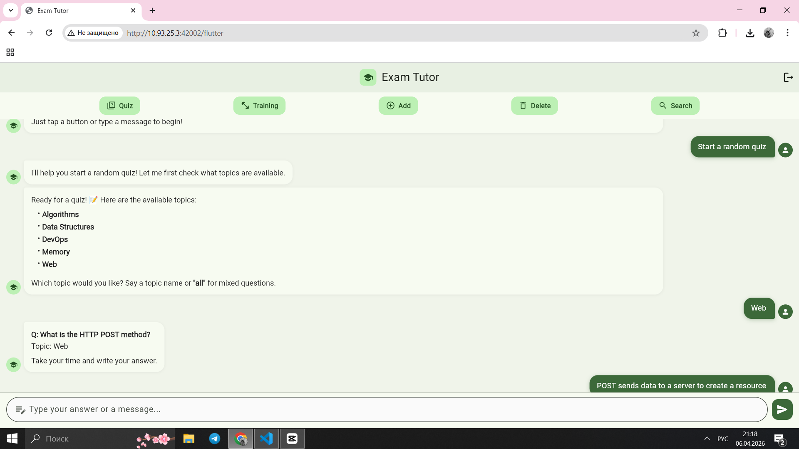
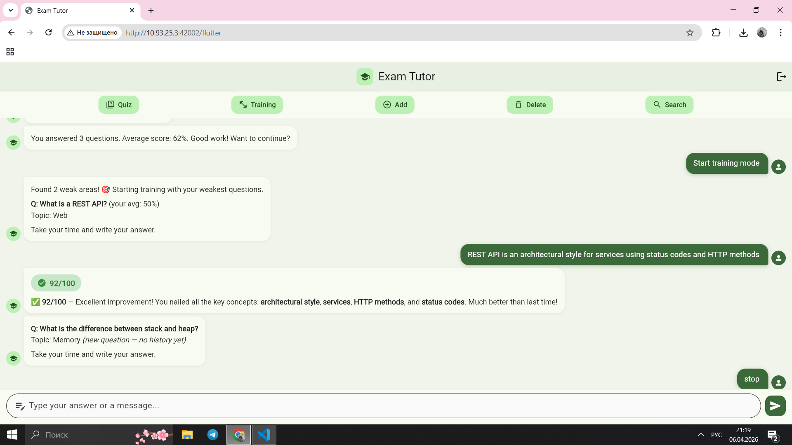

# Exam Tutor

An adaptive AI-powered exam preparation assistant that quizzes you, checks your answers with semantic scoring, and focuses on your weakest topics.

## Demo


*Random Quiz in action — the AI evaluates your answer semantically, scores it 0–100, and gives instant feedback.*


*Training Mode focuses on your weakest areas based on your past performance.*

## Product Context

### End Users

Students of technical courses (e.g., Software Engineering Toolkit) who are preparing for oral or written exams and want to find and improve their knowledge gaps.

### Problem

Students often waste time studying topics they already know well. Without feedback on what they're missing, they practice everything equally rather than focusing on their weak spots.

### Solution

The Exam Tutor uses AI to:

1. **Ask questions** from a growing database.
2. **Evaluate answers** using LLM-based semantic scoring that tolerates synonyms and phrasing differences.
3. **Track progress** to identify the user's weakest topics.
4. **Adapt** the quiz frequency so weak questions appear more often in Training Mode.

## Features

### Implemented

- ✅ **Random Quiz Mode** — Test yourself with random questions from the database (by topic or mixed).
- ✅ **Training Mode** — Practice questions you've answered poorly on, with weighted frequency.
- ✅ **Semantic Answer Scoring** — LLM-based evaluation (0–100) that understands synonyms and context, not just keywords.
- ✅ **Progress Tracking** — The system remembers which questions you struggle with.
- ✅ **Question Management** — Add, edit, delete questions or entire topics via chat.
- ✅ **Search** — Find questions by keyword in text or topic.
- ✅ **Modern Web UI** — Flutter web app with chat bubbles, score badges, quick-action buttons, and Markdown support.

### Not Yet Implemented

- ❌ Spaced repetition algorithm (e.g., SM-2) for long-term memory optimization.
- ❌ Detailed analytics dashboard with charts of progress over time.
- ❌ Import/Export questions via CSV or JSON.

## Usage

1. **Open the app** in your browser at `http://<vm-ip>:42002/flutter`.
2. **Enter the access key** you set in `.env.docker.secret` (default: `cool_api_key`).
3. **Choose a mode**:
   - Tap **📝 Quiz** to start a random quiz.
   - Tap **🎯 Training** to focus on your weak spots (requires history).
   - Tap **➕ Add** to contribute a new question to the database.
4. **Answer questions** and get instant AI feedback with a score.
5. **Manage content** using the **🗑️ Delete** and **🔍 Search** buttons.

## Deployment

### Requirements

- **OS**: Ubuntu 24.04 (or any Linux with Docker support).
- **Installed**: Docker and Docker Compose V2.
- **Ports**: Ensure ports `42001` (backend) and `42002` (gateway) are open or forwarded.

### Step-by-Step Instructions

1. **Clone the repository**:

   ```bash
   git clone https://github.com/coolcamilla/se-toolkit-hackathon.git
   cd se-toolkit-hackathon
   ```

2. **Configure environment**:
   Copy `.env.docker.example` to `.env.docker.secret` and edit the secrets:

   ```bash
   cp .env.docker.example .env.docker.secret
   nano .env.docker.secret
   ```

   Ensure these values are set:
   - `TUTOR_API_KEY`: Your secret key for API access (e.g., `my-tutor-api-key`).
   - `QWEN_CODE_API_KEY`: Your Qwen Code API key for LLM evaluation.
   - `LLM_API_MODEL`: The model name (e.g., `coder-model`).

3. **Start the system**:

   ```bash
   docker compose --env-file .env.docker.secret up -d --build
   ```

   This builds and starts 5 containers: `backend` (tutor API), `postgres` (database), `nanobot` (AI agent), `qwen-code-api` (LLM proxy), and `caddy` (reverse proxy).

4. **Verify deployment**:
   Check that the API is healthy:

   ```bash
   curl http://localhost:42002/health
   ```

   You should see `{"status": "ok"}`.

5. **Access the app**:
   Open your browser to `http://<your-vm-ip>:42002/flutter`.
